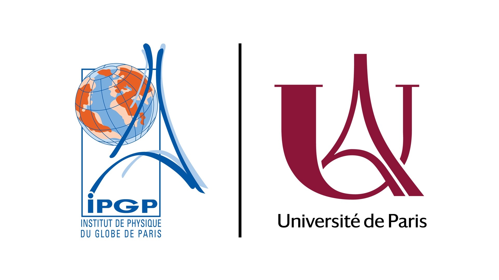

### Hey there!

My name is Tanner. I'm a graduate student studying marine geophysics at the Lamont-Doherty Earth Observatory and Columbia University. My interests are centered around tectonic margins, the structure and evolution oceanic plates, and their associated natural hazards. I utilize various types of geophysical data, but specialize in using active source seismic and electromagnetic data to image the earth on a crustal scale. My current work focuses on the hazardous subduction zones offshore Alaska, Sumatra, Nicaragua, and Mexico. This also requires that I contribute to our understanding of the formation and evolution of tectonic plates prior to subduction. 

]

## Education
| | | |
|:--:|:--:|:--:|
| </img> |Lamont-Doherty Earth Observatory, Columbia University | Ph.D. Marine Geophysics |
| </img> |Institut de Physique du Globe de Paris | MRes Exploration Geophysics |
| </img> |Texas A&M University |  B.S. Geophysics, Physics|
